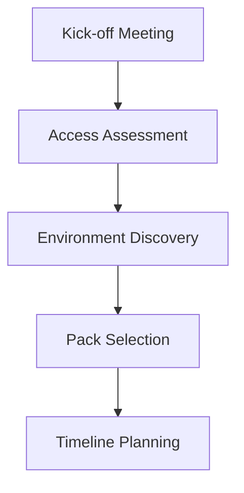
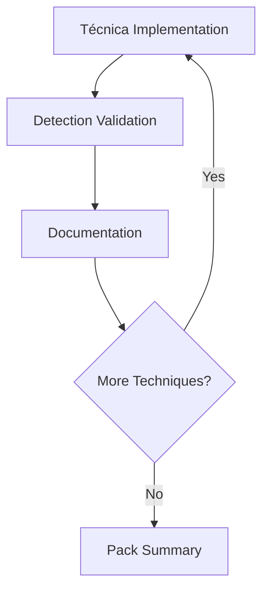

# 📦 Metodología de Paquetización de Servicios para Clientes

---

## 🎯 Objetivo

Este documento establece la metodología para organizar y entregar servicios de ciberseguridad a clientes utilizando las técnicas documentadas en este repositorio. Los servicios se estructuran en paquetes escalables según el nivel de acceso y madurez del cliente.

---

## 📋 Estructura de Paquetes

### 🔰 **Pack 1 - Fundamentos (TTPs Básicos)**
- **Objetivo**: Establecer base de seguridad y detección de ataques comunes
- **Alcance**: Técnicas básicas de AD, vectores de entrada más frecuentes
- **Duración**: 2-4 semanas
- **Prerrequisitos**: Acceso mínimo a logs de AD y herramientas básicas

### ⚡ **Pack 2 - Intermedio (TTPs Avanzados)**
- **Objetivo**: Ataques sofisticados y técnicas de movimiento lateral
- **Alcance**: Kerberos avanzado, delegaciones, ADCS, relay attacks
- **Duración**: 4-6 semanas  
- **Prerrequisitos**: Completar Pack 1, acceso ampliado o máquina de prueba

### 🎯 **Pack 3 - Experto (TTPs Especializados)**
- **Objetivo**: Técnicas de persistencia, evasión avanzada, mainframes
- **Alcance**: Golden/Silver tickets, DCShadow, mainframes z/OS, persistencia
- **Duración**: 6-8 semanas
- **Prerrequisitos**: Completar Pack 2, acceso completo o laboratorio dedicado

---

## 🏢 Escenarios de Cliente

### 🖥️ **Escenario A: Cliente con Máquina Dedicada**
**Características:**
- Proporciona máquina virtual o física para pruebas
- Acceso completo al entorno de testing
- Permite ejecución directa de técnicas

**Ventajas:**
- ✅ Ejercicios más efectivos y realistas
- ✅ Validación completa de controles
- ✅ Demostración práctica de impacto
- ✅ Posibilidad de automatización

**Metodología:**
1. **Reconocimiento**: Enumeración completa del entorno
2. **Ejecución**: Implementación directa de TTPs por pack
3. **Validación**: Verificación de detección en SIEM/XDR
4. **Documentación**: Evidencias detalladas y recomendaciones

### 📊 **Escenario B: Cliente Solo SIEM/XDR**
**Características:**
- Acceso limitado a herramientas de monitorizacion
- Sin posibilidad de ejecución directa
- Enfoque en hunting y análisis

**Ventajas:**
- ✅ Hunting activo de amenazas
- ✅ Validación de reglas de detección
- ✅ Análisis de logs históricos
- ✅ Identificación de gaps de visibilidad

**Metodología:**
1. **Hunting Activo**: Búsqueda de IOCs por pack de técnicas
2. **Análisis de Gaps**: Identificación de técnicas sin visibilidad
3. **Recomendaciones**: Hardening para técnicas no detectadas
4. **Tuning**: Mejora de reglas de detección existentes

---

## 🔄 Metodología de Implementación

### Fase 1: Evaluación Inicial (1 semana)


**Actividades:**
- Evaluación del nivel de acceso disponible
- Identificación del escenario (A o B)
- Selección de pack inicial
- Definición de objetivos específicos

### Fase 2: Ejecución por Pack (2-8 semanas según pack)


**Actividades por Técnica:**
1. **Ejecución/Hunting**: Según escenario del cliente
2. **Validación**: Verificar detección o ausencia
3. **Documentación**: Registrar hallazgos y evidencias
4. **Recomendaciones**: Hardening si no hay detección

### Fase 3: Entregables y Follow-up (1 semana)
**Documentos:**
- 📊 Executive Summary por pack
- 🔍 Technical Report detallado
- 🛡️ Hardening Recommendations
- 📈 Security Roadmap para siguientes packs

---

## 📊 Framework de Evaluación

### Matriz de Resultados por Técnica

| TTP | Ejecutado | Detectado | SIEM Alert | Hardening Req. | Prioridad |
|-----|-----------|-----------|------------|----------------|-----------|
| Kerberoasting | ✅ | ❌ | ❌ | ✅ | Alta |
| Golden Ticket | ✅ | ✅ | ⚠️ | ⚠️ | Media |
| Pass-the-Hash | ✅ | ✅ | ✅ | ❌ | Baja |

**Leyenda:**
- ✅ = Completo/Exitoso
- ❌ = No presente/Fallido  
- ⚠️ = Parcial/Necesita mejora

### Scoring por Pack

**Fórmula de Madurez:**
```
Score = (Técnicas Detectadas / Total Técnicas) × 100
```

**Niveles:**
- 🔴 **0-30%**: Crítico - Requiere hardening inmediato
- 🟡 **31-70%**: Medio - Mejoras necesarias
- 🟢 **71-100%**: Bueno - Optimizaciones menores

---

## 🛠️ Herramientas y Recursos

### Herramientas por Escenario

**Escenario A (Máquina Dedicada):**
- Impacket Suite
- Rubeus
- BloodHound
- CrackMapExec/NetExec
- PowerView
- Mimikatz

**Escenario B (Solo SIEM/XDR):**
- Queries de hunting personalizadas
- Scripts de análisis de logs
- Reglas Sigma/Yara
- Dashboards de monitorizacion

### Templates de Documentación
- 📋 Checklist de ejecución por pack
- 📊 Plantillas de reporting
- 🎯 Roadmaps de hardening
- 📈 Métricas de seguimiento

---

## 🔄 Proceso de Escalamiento

### Criterios para Avanzar al Siguiente Pack

1. **Pack 1 → Pack 2:**
   - ≥70% de técnicas básicas detectadas
   - Controles de red básicos implementados
   - Logs de AD configurados correctamente

2. **Pack 2 → Pack 3:**
   - ≥80% de técnicas intermedias detectadas
   - Herramientas avanzadas de monitorizacion activas
   - Equipo de SOC entrenado en TTPs intermedios

### Recomendaciones por Resultado

**Alta Detección (>80%):**
- Proceder al siguiente pack
- Implementar técnicas de evasión
- Enfocar en automatización

**Detección Media (50-80%):**
- Reforzar controles específicos
- Repetir técnicas después de hardening
- Capacitación adicional del equipo

**Baja Detección (<50%):**
- Hardening intensivo requerido
- Revisión de arquitectura de seguridad
- Considerar postponer siguiente pack

---

## 📚 Referencias

- [Service-Packages.md](Service-Packages.md) - Definición detallada de cada pack
- [Client-Scenarios-Implementation.md](Client-Scenarios-Implementation.md) - Guías específicas por escenario
- [AD-Tecnicas-Completas.md](AD-Tecnicas-Completas.md) - Catálogo completo de técnicas disponibles

---

*Actualizado: Agosto 2024*  
*Autor: [MinoTauro2020](https://github.com/MinoTauro2020)*